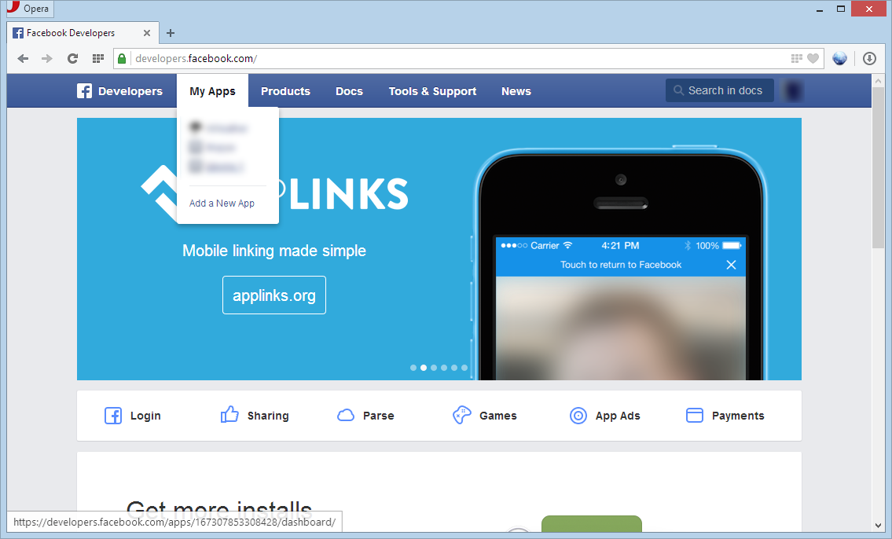
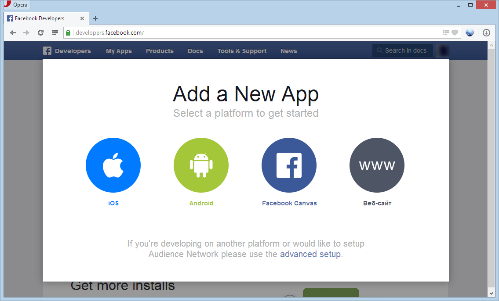
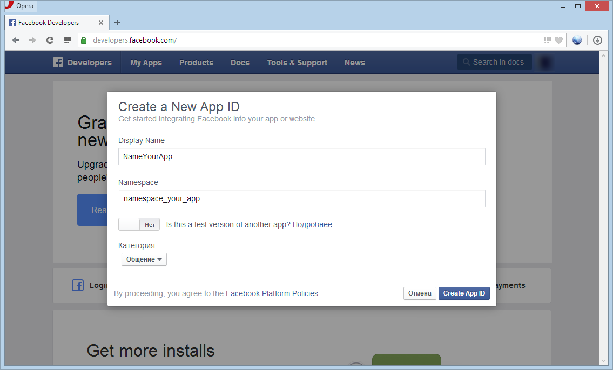
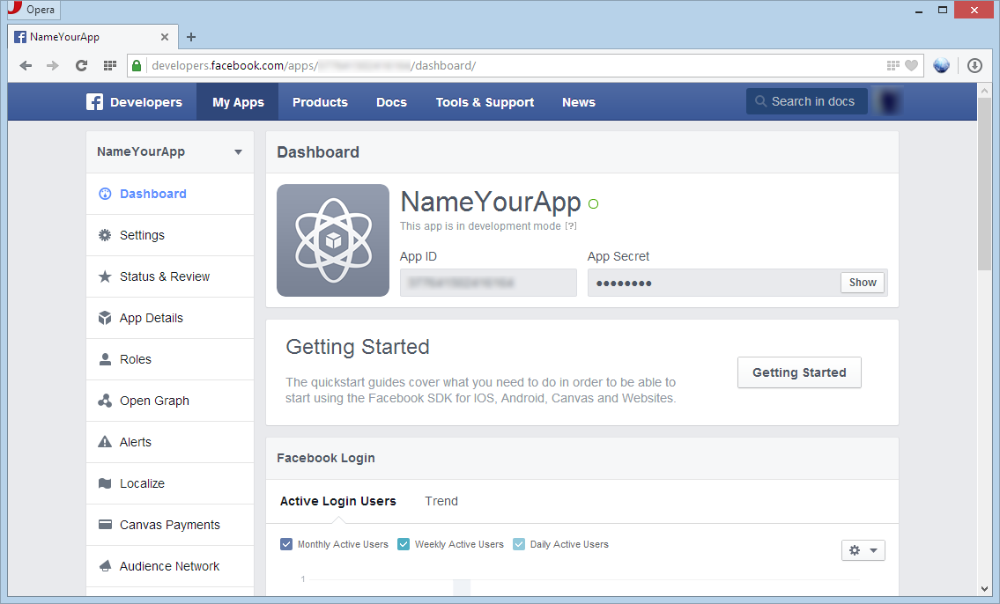
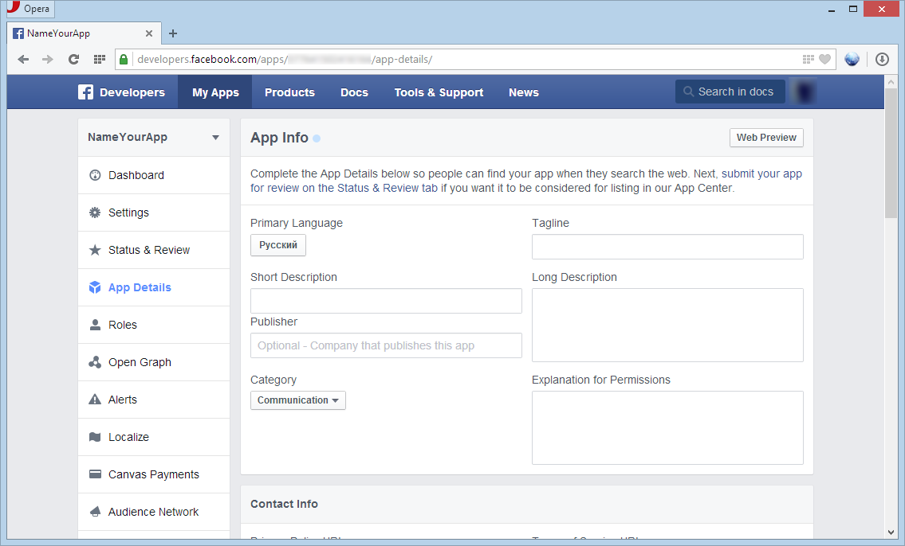
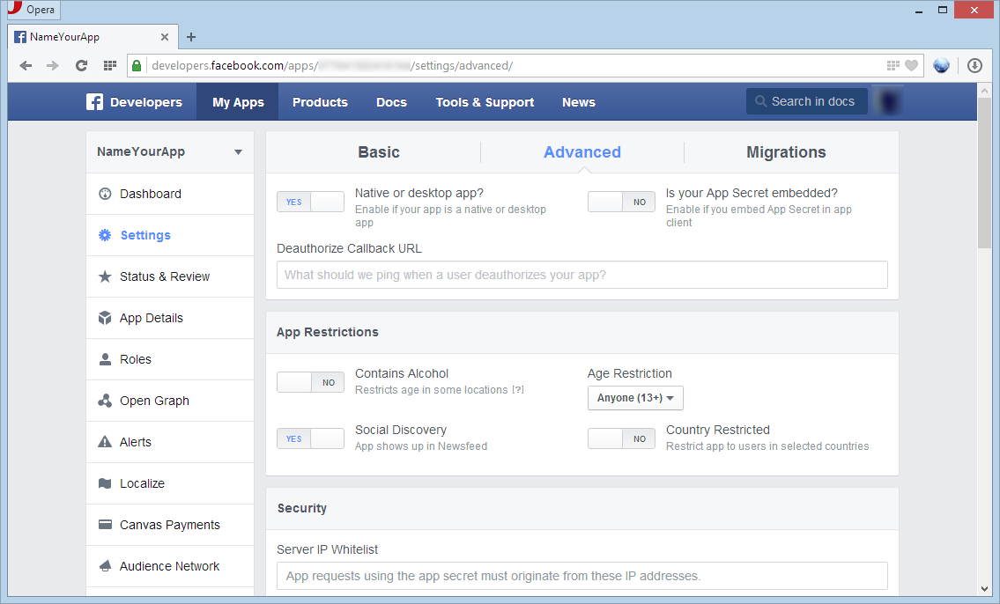

How to get App ID in Facebook
=============================

1. Login in Facebook or sign up, if you don't have account. 
2. Go to [developers.facebook.com](https://developers.facebook.com/), then hover to **My Apps** and select item **Add a New App**. [[1]](#img1)
3. Select a platform to get started or if you need create native app use the ***advanced setup***. [[2]](#img2)
4. Write in the field **Display Name** name your application and fill in the **Namespace**, then push the button **Create App ID**. [[3]](#img3)
5. In **Dashboard** you can get your public **App ID**. [[4]](#img4)
6. Write detail information about your application and upload App Icon (You can select **App Details** item). [[5]](#img5)
7. Go to **Settings**, then choose tab **Advanced** and switch on **Native or desktop app** and save changes. [[6]](#img6)

Other information your can get in [developers.facebook.com/docs](https://developers.facebook.com/docs).

## Screenshots

 

 

 

 

 

 

## References

1. [Client Application Authorization (if you don't use Android, IOS or Windows Phone SDK)](https://developers.facebook.com/docs/facebook-login/manually-build-a-login-flow/v2.2)
2. [Quickstart for Graph API](https://developers.facebook.com/docs/graph-api/quickstart/v2.2)
3. [Graph API Reference](https://developers.facebook.com/docs/graph-api/reference/)
4. [Graph API Explorer](https://developers.facebook.com/tools/explorer/)