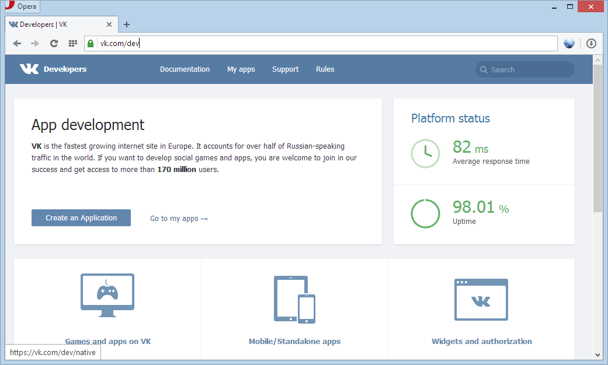
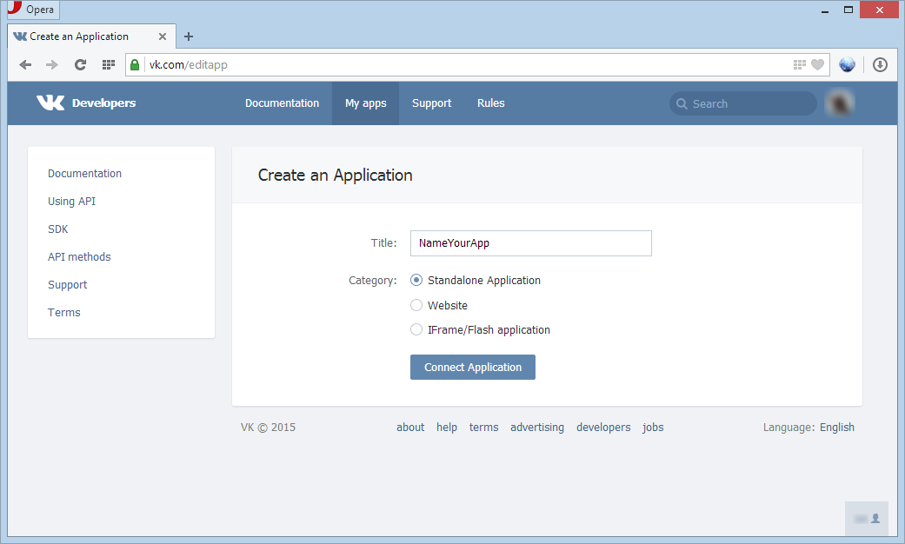
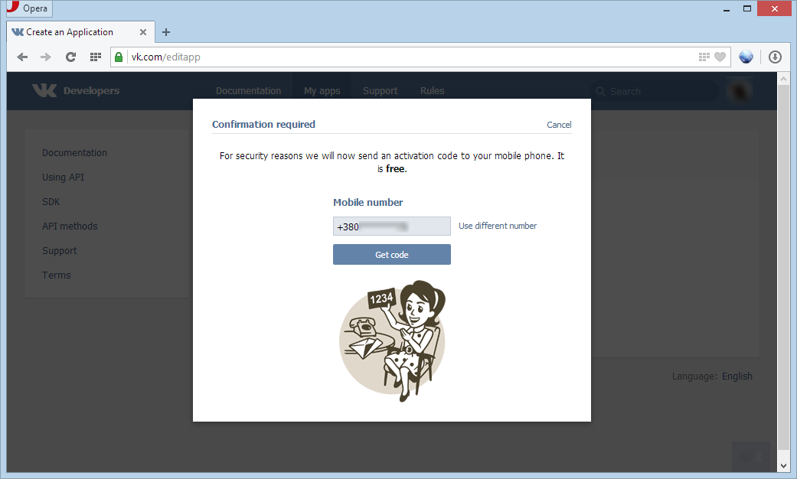
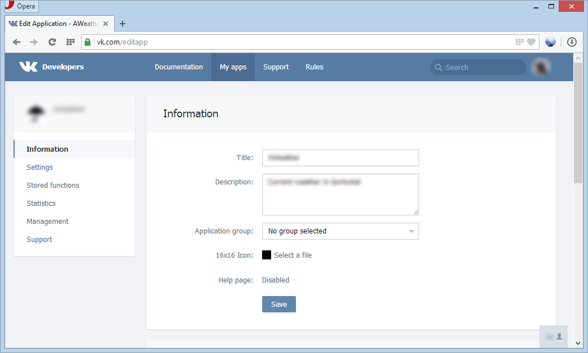
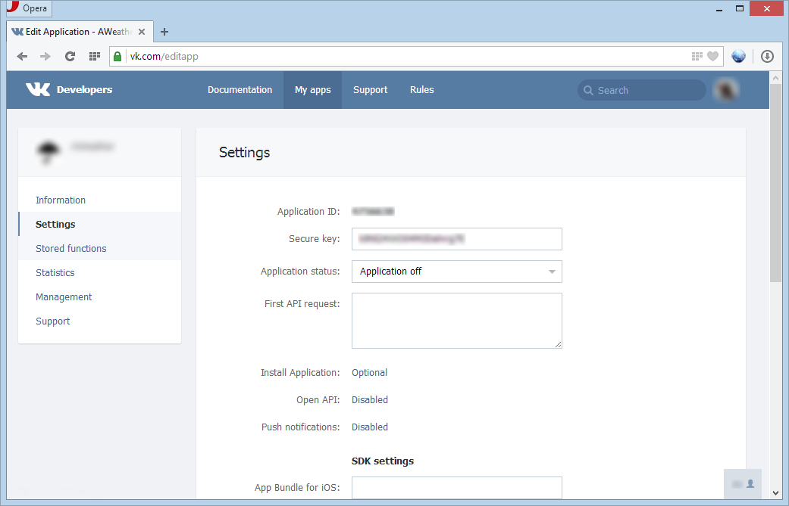

How to get App ID in VK
=======================

1. Login in VK or sign up, if you don't have account. 
2. Go to [vk.com/dev](https://vk.com/dev) and push the button **Create an Application**. [[1]](#img1)
3. Write in the field **Title** name your application and choose category (In this case **Standalone Application**). And push the button **Connect Application**. [[2]](#img2)
4. Enter activation code. [[3]](#img3)
5. Write detail *Information* about your application. [[4]](#img4)
6. Go to the menu **Settings** and get your public **Application ID**. [[5](#img5)

More information your can get in [vk.com/dev/apiusage](https://vk.com/dev/apiusage).

## Screenshots

 

 

 

 

 

## References

1. [Client Application Authorization (if you don't use Android, IOS or Windows Phone SDK)](https://vk.com/dev/auth_mobile)
2. [API Requests](https://vk.com/dev/api_requests)
3. [All API method](https://vk.com/dev/methods)
